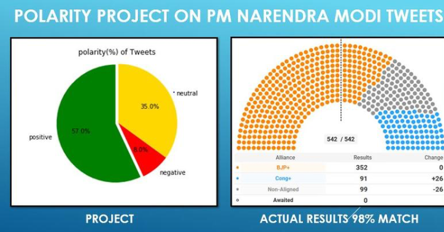
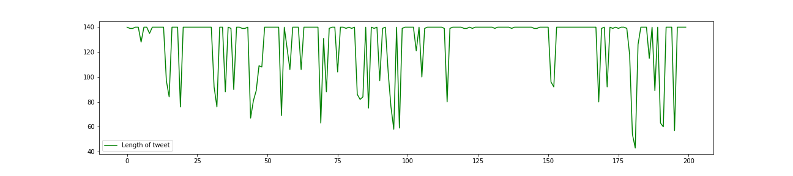
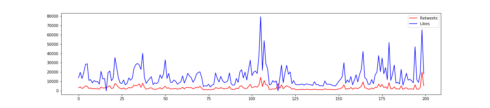
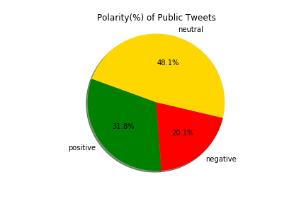
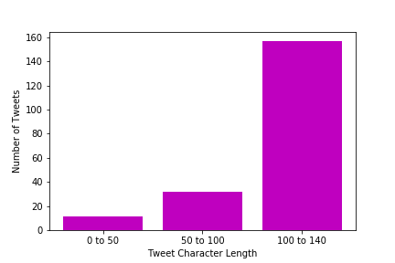

# Indian Elections, Text-Mining Group-Project 
Text Mining Data from Twitter APIs

# Goal
Create a scripit using Python that extract Tweets related to the prime minister of India, "Narendra Modi"
and get Insights about his popularity. 

# Plan
- Extract Tweets of #Modi and Modi account from last 14 days using Python and Twitter APIs.
- Create a Data Frame using Panda Library to store the Tweets.
- Clean the data removing uncessary characters.
- Munging the data and slice it into the columns (user, tweet, date, likes, retweets and len)
- Classifying the sentiment polarity of tweets using TextBlob Library.
- Peform a Sentiment Analysis using  TextBlob and Panda Library.
- Use WorldCloud library To show most frequently words.
- Perform Visualization methods (pie Chart, scatter plot, bar plot)

# Findings

Based on Modi’s Popularity on Twitter, he is front and center in upcoming election

* Only 8% of his tweets has negative sentiment, doing fairly good in writing tweets.
* 32% of twitter users have positive sentiment for him.
* Roughly 20% of users are against him. This may include the opposition.

### Comparison of our Polarity PieChart against the results of recent Election in India

# Visualizations

	

