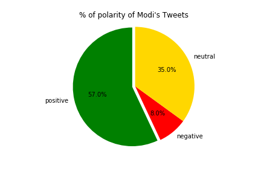
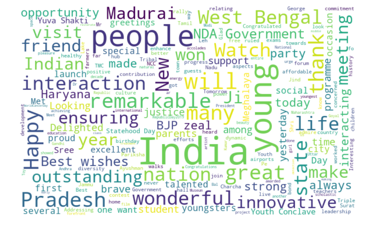

# Idian Elections, Text-Mining Group-Project 
Text Mining Data fromm Twitter APIs

# Goal
Create a scripit using Python that extract Tweets related of the prime minister of India called "Modi"
and get Insights about his popularity. 

# Plan
- Extract Tweets of #Modi and Modi account from last 14 days.
- Create a Data Frame using Panda Library to stored the Tweets.
- Clean the data removing uncessary characters.
- Munging the data and slice it into the columns (user, tweet, date, likes, retuits and len)
- Classifying the data using TextBlob Library.
- Peform a Sentiment Analysis using  TextBlob and Panda Library.
- Use WorldCloud library To show most frequently words.
- Perform Visualization methods (pie Chart, scatter plot, bar plot)

# Finds
Based on Modi’s Popularity on Twitter, he is front and center in upcoming election

- Only 8% of his tweets has negative sentiment, doing fairly good in writing tweets.

- 32% of twitter users have positive sentiment for him.

- Roughly 20% of users are against him. This may include the opposition.

